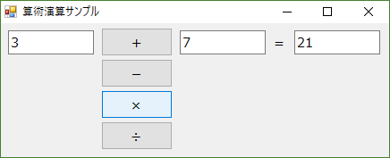

# 概要
ITSS準拠の研修カリキュラム「プログラミングの基礎（B121）」のうち、「文法：式と演算子」の実習として、数値の四則演算プログラムを作る実習の完成品サンプルです。
各課題は別々のプログラム（別プロジェクト）として作成してください。また、作成するアプリケーションはWindows Formを想定しています。
ここで掲示しているプログラムは正解サンプルです。実際の課題実施に際しては、新人にはゼロからプログラムを作ってもらいます。

# 課題

## 事前準備

### 新人用説明文
下記の要件を満たすプログラムを作ってください。

- 3つのテキストボックスと、4つのボタン、「＋」「ｰ」「×」「÷」がフォームに配置されている。
- ボタンが押されると、テキストボックス2個に入力された数値を計算し、3つめのテキストボックスに表示する。計算内容は、押されたボタンの種類に応じて決定する。

できあがり品のイメージは下図のようになります（細かいところは各自で好きに作って構いません）。

## 課題1: 四則演算

## 課題2: キャストによる数値の変換

## 課題3: 文字と数値の扱い
